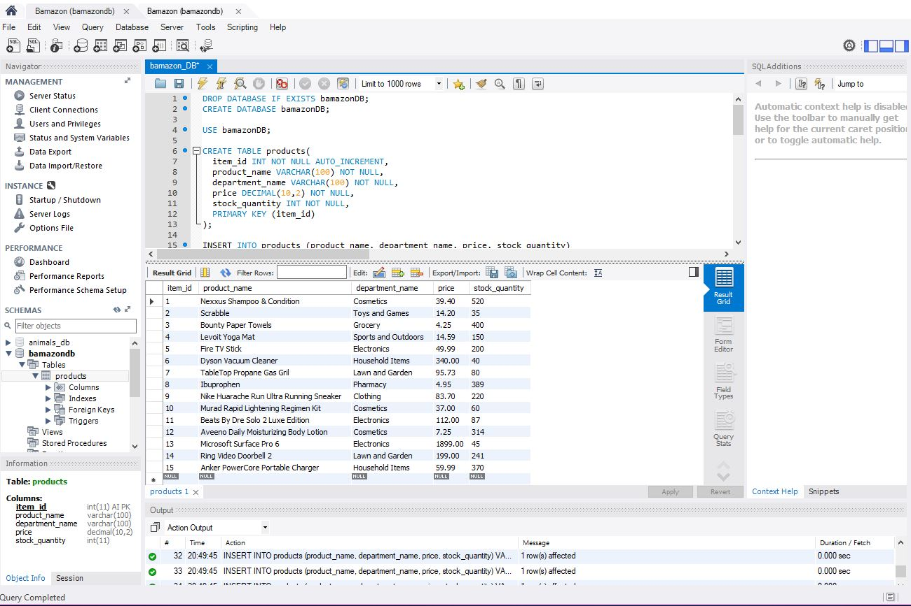
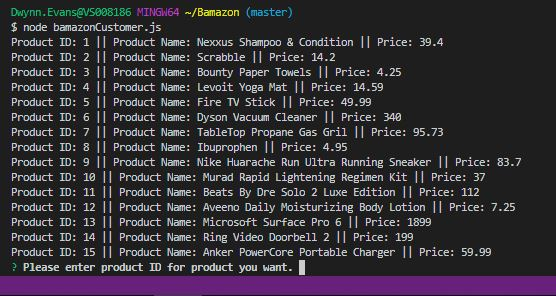
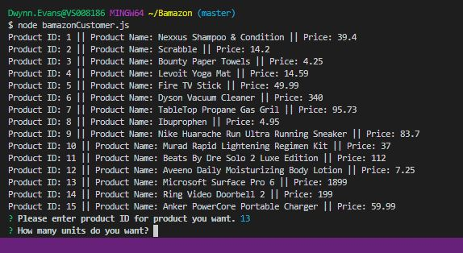

# Bamazon
An interactive shopping node app where MySQL and Node.JS are used to allow users to purchase items as a customer. 

##### Bamazon Customer Portal
The Bamazon Customer Portal allows users to view the current items available for purchase.  The user will be prompted to enter the item id# and how many items they wish to purchase.  If the item is in stock, the order will be completed and the user will see the total amount of their purchase.

##### Step 1: Create Bamazon DataBase 

##### Step 2: Run Bamazon in Terminal
Install the required dependencies 
##### $ node bamazonCustomer.js : 
This will first display all of the items available for sale and include the ID#, Product Name and Price.

##### Step 3: Enter the Product ID you would like to buy

##### Step 4: Enter the amount of products you would like to buy

##### Step 4: Product fullfillment
If the store has enough merchandise, then the order will be fullfilled and the customer will be notified: "Yay, your purchase is complete. Payment has been received in the amount of:..."

If the merchandise is out of stock, the customer will be notified: "There isn't enough stock left!"

#### Technologies Used:

* Javascript
* nodeJS
* MySQL
* npm packages
